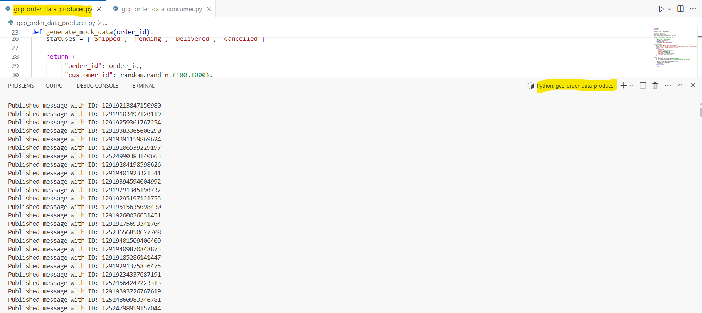
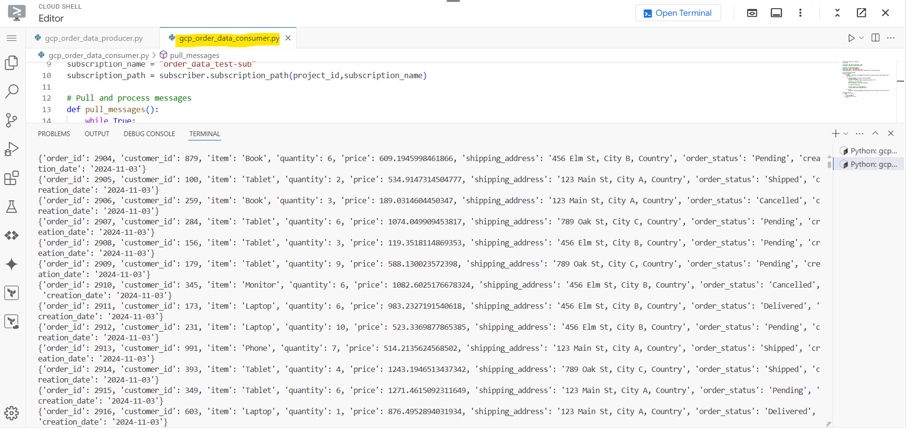

# GCP Pub/Sub Example

## Description
This project demonstrates the use of Google Cloud Pub/Sub, a messaging service for building event-driven systems. The project consists of two main components: a producer that sends messages to a Pub/Sub topic and a consumer that listens for and processes messages from a subscription. This setup enables efficient and scalable communication between different parts of your application.

## Features
- **Producer**: Generates mock order data and publishes it to a specified Pub/Sub topic. It handles message acknowledgments and includes a callback function to manage the publishing results.
- **Consumer**: Pulls messages from a Pub/Sub subscription, deserializes the JSON data, and processes the messages accordingly. The consumer acknowledges messages after processing to prevent them from being received again.

## Getting Started

### Prerequisites
To run this project, you will need:
- Python 3.x installed on your machine.
- The following libraries:
  - `google.cloud.pubsub`: This library allows you to interact with Google Cloud Pub/Sub services.
  - `json`: For handling JSON data.

### Installation
Install the required library using pip. Open your terminal or command prompt and run the following command:
    `pip install google-cloud-pubsub`

### Procedure for GCP Pub/Sub Project

### Step 1: Set Up Google Cloud Project
1. Create a Google Cloud account.
2. Create a new project in the Google Cloud Console.
3. Enable the Google Cloud Pub/Sub API for your project.

### Step 2: Create a Pub/Sub Topic
1. Navigate to the Pub/Sub section in the Google Cloud Console.
2. Click **Create Topic** and name your topic (e.g., `your_topic_name`).

### Step 3: Create a Pub/Sub Subscription
1. Select the topic you created.
2. Click **Create Subscription** and name your subscription (e.g., `your_topic_name-sub`).

### Step 4: Prepare Your Local Environment
1. Install Python 3.x on your machine if not already installed.
2. Install the required library using pip:
   `pip install google-cloud-pubsub`

### Step 5: Authenticate with Google Cloud
Run the following command to authenticate your application:
    `gcloud auth application-default login`
This will open a new browser window where you need to select your registered email ID for the GCP account.

### Step 6: Run the Producer and Consumer
1. Execute producer.py code
2. Execute consumer.py code

### Step 7: Monitor the Output
* Check the terminal where the producer is running for published message IDs.
* Observe the consumer terminal for the processed messages.
* You can also check the messages in the GCP Pub/Sub UI by navigating to your subscription to see the messages that have been published.

## Output

Here are some screenshots demonstrating the output of the project:

## Contributions
Contributions are welcome! If you'd like to contribute, please fork the repository and submit a pull request with your enhancements.

## License
This project is licensed under the MIT License - see the [LICENSE](LICENSE) file for details.

## Acknowledgments
Special thanks to the Google Cloud team for providing the Pub/Sub service and the open-source community for their invaluable contributions.